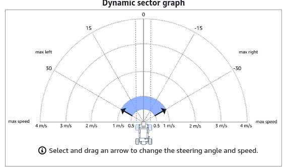
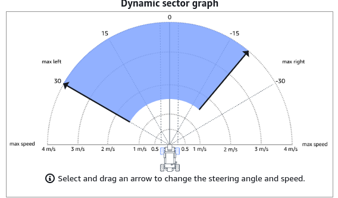
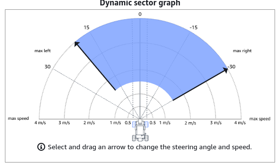
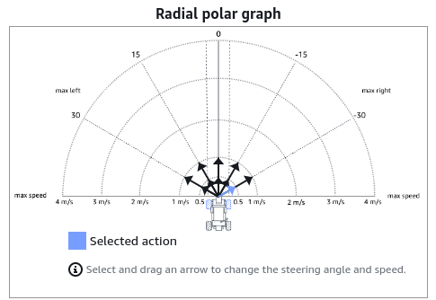
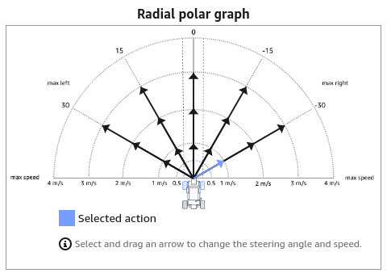
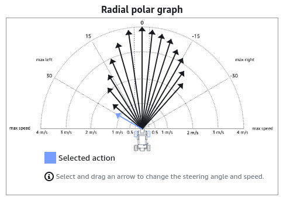
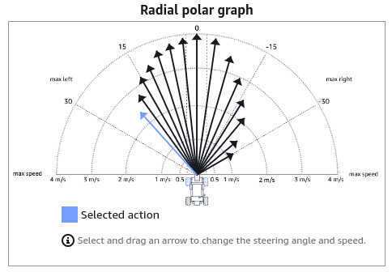

# Deepracer Steering Strategies

The following are some examples of various steering strategies that can be using EC2 traing and also in Deepracer console.

| # | Action Space | Preview | Steering Range | Steering Ganularity | Speed Range | Speed Ganularity | Metadata |
|---| :---| :---| :---| :---| :---| :---| :---|
| 1 | Continuous |  | 30 (L) to -30 (R) | - | 0.5 - 1 | - | [Metadata.json](./assets/metadata/continuous_30_-30_0.5-1_metadata.json) |
| 2 | Continuous |  | 30 (L) to -20 (R) | - | 1.5 - 4 | - | [Metadata.json](./assets/metadata/continuous_30_-20_1.5-4_metadata.json) |
| 3 | Continuous |  | 20 (L) to -30 (R) | - | 1.5 - 4 | - | [Metadata.json](./assets/metadata/continuous_20_-30_1.5-4_metadata.json) |
| 4 | Discrete |  | 30 (L) to -30 (R) | 5 | 0.5 - 1 | 2 | [Metadata.json](./assets/metadata/discrete_30_-30_0.5-1_st5_sp2_metadata.json) |
| 5 | Discrete |  | 30 (L) to -30 (R) | 5 | 1 - 3 | 3 | [Metadata.json](./assets/metadata/discrete_30_-30_1-3_st5_sp3_metadata.json) |
| 6 | Discrete |  | 30 (L) to -21 (R) For Steep Left Curves | - | 1.2 - 4 | - | [Metadata.json](./assets/metadata/discrete_left_steering_priority_metadata.json) |
| 7 | Discrete |  | 21 (L) to -30 (R) For Steep Right Curves | - | 1.2 - 4 | - | [Metadata.json](./assets/metadata/discrete_right_steering_priority_metadata.json) |

These strategies can be extended or modfied accordign to the race track and how the model is being trained. The above mentioned are only for example.